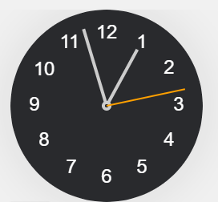

### 1. Suppose you roll a fair 6-sided die until you've seen all 6 faces. What is the probability you won't see an odd numbered face until you have seen all even numbered faces?

It's important to realize that you should not focus on the number of rolls in this question, but rather the ways to order when a face has been seen. ie) The sequence 2, 5, 3, 1, 4, 6 represents your first unique sighting being a 2, second being a 5, third being 3, and so on. In other words, we don't care about sth like 2, 2, 5, 2, 3... They are same as 2, 5, 3.
This would be an invalid sequence as we have seen an odd numbered face before seeing all the even numbered faces.

There are 6! total orderings. We can use this as our denominator. 

For our numerator, we want to group only even numbers for the first 3 sightings, and the remaining odd numbers for the last 3.

For first 3, there will be $^3C_3$ = 3! combination, so as well as last 3.

The result would be $\frac{3! \times 3!}{6!} = \frac{1}{20}$.

### 2. What is the expected number of cards you need to draw from a 52-card deck before you see the first ace?

Assume all 4 aces are identical, so do the rest cards.

There would be 4 ace in 52 cards, $A_1$, $A_2$, $A_3$, $A_4$. There would be

\__$A_1$\__$A_2$\__$A_3$\__$A_4$\__
5 gaps.

The rest 48 card will be placed in these 5 gaps, the expected value is equal to average value due to law of large number $48/5 = 9.6$ 
So the next would be the first ace 9.6+1 = **10.6** 

***It is important to know the first ace is included or not.***

### 3. Jim will roll a fair, six-sided dice until he gets a 4. What is the expected value of the highest number he rolls through this process?

Because we stop until 4, so the highest number is at least 4. There would be 3 situation, the highest is 4, 5 and 6.

If highest is 4, that means no 5 and 6, which would be $\frac{1}{3}$.

If highest is 6, that means we end with sth like {6, 4} with other number between them. For situation {4, 6} and {6, 4}, probability is $\frac{1}{2}$.

If highest is 5, that would be 
{4, 5, 6}
{4, 6, 5}
{5, 6, 4}
{5, 4, 6}
{6, 4, 5}
{6, 5, 4}
totally 3! = 6 situations, and only {5, 4, 6} works for highest is 5. Probability would be $\frac{1}{6}$

$$EV = 4 \times P(4) + 6 \times P(6) + 5 \times P(5) = 4 \times \frac{1}{3} + 6 \times \frac{1}{2} + 5 \times \frac{1}{6} = \frac{31}{6}$$

### 4. You place three dots along the edges of an octagon at random. What is the probability that all three dots lie on distinct edges of the octagon?

$$\frac{8}{8} \times \frac{7}{8} \times \frac{6}{8} = \frac{336}{512} = \frac{21}{32}$$ 

### 5. Two gamblers are playing a coin toss game. Gambler A has (n+1) fair coins; B has n fair coins. What is the probability that A will have more heads than B if both flip all their coins?

There is only two situations, A has more head and A has more tail, therefore, by symmetry, probability is $\frac{1}{2}$. 

***[The green book](./resource/a-practical-guide-to-quantitative-finance-interviews.pdf) page 77 on pdf, 61 for the book itself for detailed method***

### 6. A building has 10 floors above the basement. If 12 people get into an elevator at the basement, and each chooses a floor at random to get out, independently of the others, at how many floors do you expect the elevator to make a stop to let out one or more of these 12 people?

***Hints:*** 
The question can be simplified into what is expected value of stopped floor.

We can use [Indicator Random Variables](./resource/IndicatorRandomVariables.pdf) here. When you want to calculate how many times for an event happens, like how many boxes are non-empty, how many days is rainy. We can convert this kind of question into 
$$X = X_1 + X_2 + X_3 ... + X_n$$

Each $X_i$ is the indicator for event $i$ happen or not (0 or 1).

So the total EV would be:
$$
E[X] = E\left[\sum X_i\right] = \sum E[X_i]
$$
***Which is Linearity of Expectation***

For each event $i$ EV would be:
$$
E[X_i] = P(X_i = 1) = P(\text{happen})
$$

Therefore, for floor 1 is stopped, or is chose by at least one people $$E[X_1] = P({X_1 = 1}) = 1 - (\frac{9}{10})^{12} = 0.7176$$ 

$$
E[X] = E\left[\sum X_i\right] = \sum E[X_i] = 10 \times E[X_i] 
= 10 \times 0.7176 = 7.176
$$
 

 ### 7. Drawing two cards from 52 cards, what is prob of two cards are both red.
 
 Choosing 2 cards from 52 cards would be $$C^{52}_{2} = \frac{52 \times 51}{2} = 1326$$

 Choosing 2 cards from 26 red cards would be $$C^{26}_{2} = \frac{26 \times 25}{2} = 325$$

$$P = \frac{325}{1326} = \frac{25}{102}$$

### 8. Two players take turns rolling two six-sided dice. Player A goes first, followed by player B. If player A rolls a sum of 6, they win. If player B rolls a sum of 7, they win. If neither rolls their desired value, the game continues until someone wins. What is the probability that player A wins?

For A there would be following ways: 1&5, 2&4, 4&2, 3&3, 5&1 **5 ways** $P_A = \frac{5}{36}$
For B there would be following ways: 1&6, 2&5, 3&4, 4&3, 5&2, 6&1 **6 ways** $P_B = \frac{1}{6}$

If A win the first round, probability is $P_A$
If A lost the first round, and B lost B's round, A win after that, probability is $(1-P_A)(1-P_B)P_A$
A and B lost both first two round, A win the third
$((1-P_A)(1-P_B))^2P_A$

Total probability of A win $P(A $ wins$) = P_A + (1-P_A)(1-P_B)P_A + ((1-P_A)(1-P_B))^2P_A$

We can express the probability as 
$(1-P_A)^k(1-P_B)^kP_A$
which is absolutely a **geometric series**
#### Geometric Series Formulas

##### Finite Sum
$$
S_n = a + ar + ar^2 + \cdots + ar^{n-1} = a \frac{1 - r^n}{1 - r} \quad (r \neq 1)
$$

> If $ r = 1 $: $ S_n = n a $

##### Infinite Sum ($ |r| < 1 $)
$$
S = a + ar + ar^2 + \cdots = \dfrac{a}{1 - r}
$$

$1-P_A = \frac{31}{36}$ and $1-P_B = \frac{5}{6}$

### 9. What is the angle between hour and minute needle at 3.15?

Here is a picture of clock

Hour hand move $360/12=30\degree$ each hour, so it move $30/60=0.5\degree$ each minute.

Minute hand move $360/60=6\degree$ each minute.

So for hour hand,  3.15, we see 12 o'clock is the start, and 3 o'clock is $90\degree$. 3.15 would be $90 + 15\times 0.5 = 97.5\degree$

For minute hand, 15min would be $6\times15=90\degree$

So the angle would be $97.5-90=7.5\degree$

### 10. How many golfballs can fit in a boeing 747. (Ridiculous and senseless question)

A classic Fermi estimation question. Ask a bit more questions before asking, showing you are really thinking, like "Do we consider the 747 to be completely empty, or is it a fitted passenger plane with seats, overhead compartments etc". 

Then estimate the size of objects, golfball and boeing 747. Here is the formula you need:

***1. Volume of a Cylinder***

**Formula:**

\[
V = \pi r^2 h
\]

**Parameters:**
- \( r \): radius of the base  
- \( h \): height of the cylinder  
- \( \pi \approx 3.14159 \)

***2. Volume of a Sphere***

**Formula:**

\[
V = \frac{4}{3}\pi r^3
\]

**Parameters:**
- \( r \): radius of the sphere  

We may say golfball is a sphere and boeing is cylinder, because the wing cannot contain anything.

For a golfball, radius could be **1.5cm** in diameter, and boeing is **20 meter high, 200 meter long**. So the volume of golfball is about $1.8*10^{-3} m^{2}$, of boeing is $62800 m^{2}$, there would be $3.5*10^{7}$ golfballs. However, it would be impossible for all the balls to perfectly fit in the airplane, hence there is still a certain amount of free space. We may say 5% space can would be empty, so $3.3*10^{7}$. If the interviewer says there is seat, compartments, we may say it's about 60% space can be used for golfball, so $2.0*10^{7}$.

***The important thing is, showing your logic and how you gather and process information, explain you do not have exact parameters, value and data, so you can only estimate it. Talk more instead of giving calculations***

### 11. If you flip a coin 100 times, how many heads do you expect?

The expect value is average value so 50 if it is a fair coin.

### 12. How many windows are in London? (Ridiculous and senseless question)

Another Fermi estimation question. This kind question always need diverse set of knowledge. The population of London is about 9 millions (9,000,000).

Many object have windows, this includes homes, offices, shops, cars, buses, trains.

We can say 10 windows per household so 5 per person
Public place, like school, office, shops, we may say 8 per person
Transport like bus, underground, 2 per person

So 15 per person, $9,000,000\times 15 = 1.5*10^{8}$ windows

### 13. Two trains start toward each other from different cities… when do they meet?

No exact value is annoying, that means you set up your variable names.

Distance betweens citis: $D$
Speed for train1: $v_{1}$
Speed for train2: $v_{2}$
Time: $t$

$v_{1}t + v_{2}t = D$
$t = \frac{D}{v_{1}+v_{2}}$

### 14. Why are manhole covers round? (Ridiculous and senseless question)

1. A round cover cannot fall through its own opening

A circle has the same diameter in all directions.
So the cover, no matter how you rotate it, can’t slip into the hole.
This is the most important reason.

2. Easier to move

Round covers can be rolled instead of lifted, which is safer and requires less effort.

3. No need to align

A circular cover fits the opening in any rotation, so workers don’t need to orient it before placing it back.

4. Even distribution of pressure

Earth pressure around the manhole is uniform, and a circular shape handles this stress efficiently.

5. Cheaper to manufacture

A circular frame and cover are mechanically simple and strong, reducing complexity.

### 15. In 23 people group, what is the probability that two people have the same birthday?

***Ignore leap years here***
$P = \frac{1}{365}$

So probability for 23 people they all have different birthday $P(N) = \frac{365\times364\times...\times365-23+1}{365^{23}} = 0.49$

$P(at\ leat\ two\ have\ same) = 1-0.49 = 0.50$

### 16. You have 8 balls, one heavier. How to find it in 2 weighings?

Into 3 groups:
Group A: 3 balls
Group B: 3 balls
Group C: 2 balls

Comparing A and B, there are 3 cases:
If A and B are equal, then heavier one is in C
Compare 2 balls in C can find it

If A is heavier, then heavier one is in A, so comparing the 3 within group A
Compare two balls 1 and 2 within A, if 1 or 2 are different, we can find the heavier one. If they are same, 3 is heavier. 

If B is heavier, then heavier one is in A, so comparing the 3 within group B